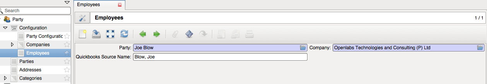
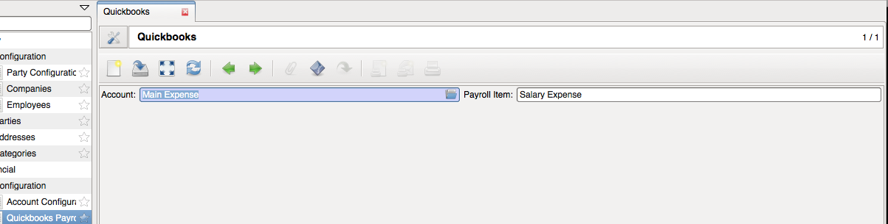
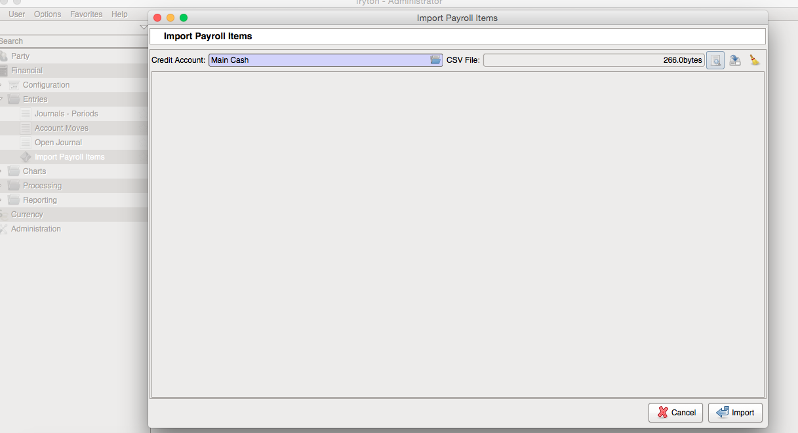

Trytond QuickBooks Payroll
==========================

Module helps to import payroll entries from quickbooks to tryton. It expects a
csv file in following format::

  Date,Num,Type,Source Name,Payroll Item,Wage Base,Amount
  04/01/2015,309333,Cash,"Blow, Joe",Salary Expense,,-100000
  ,,,"Blow, Joe",Federal Income Taxes Payable,,15000
  ,,,"Blow, Joe",State Income Taxes Payable,,5000
  ,,,"Blow, Joe",FICA Taxes Payable,,7650
  ,,,,,,72350

How to use it?
--------------

First you will have to map tryton employee with quickbooks source name.
Go to ``Party >> Configuration >> Companies >> Employees``

Map accounts with quickbooks payroll item,
``Financial >> Configuration >> Quickbooks Payroll``

Now go to Import Payroll Items wizard (``Financial >> Entries >> Import Payroll Items``), choose Credit Account,
account which will have effective balance and and click the search icon to select
the csv file of quickbooks payroll entries from your computer.

This creates an account move corresponding to payroll entries in csv. For
now it can only import one payroll entry at a time!

Authors and Contributors
------------------------

This module was built at `Openlabs <http://www.openlabs.co.in>`_. 

Professional Support
--------------------

This module is professionally supported by `Openlabs <http://www.openlabs.co.in>`_.
If you are looking for on-site teaching or consulting support, contact our
`sales <mailto:sales@openlabs.co.in>`_ and `support
<mailto:support@openlabs.co.in>`_ teams.
